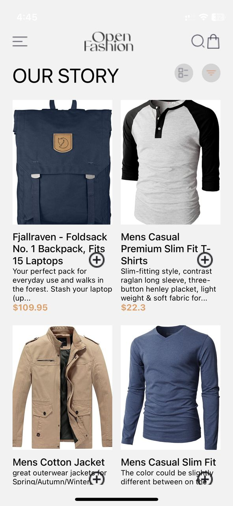
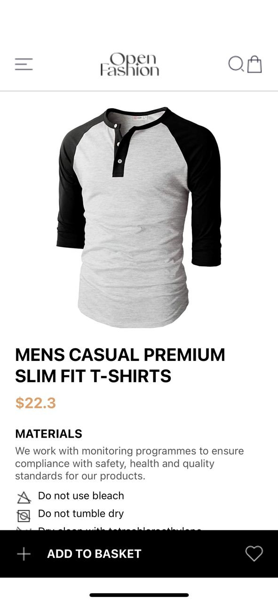
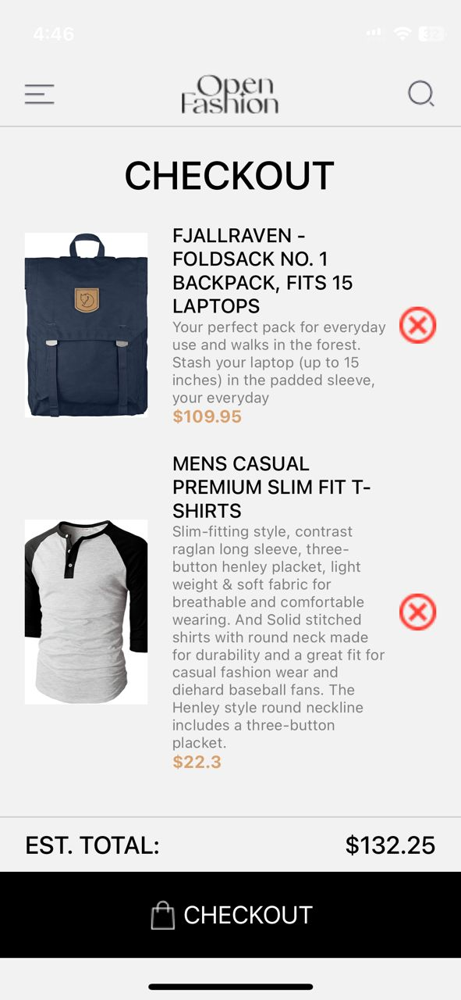
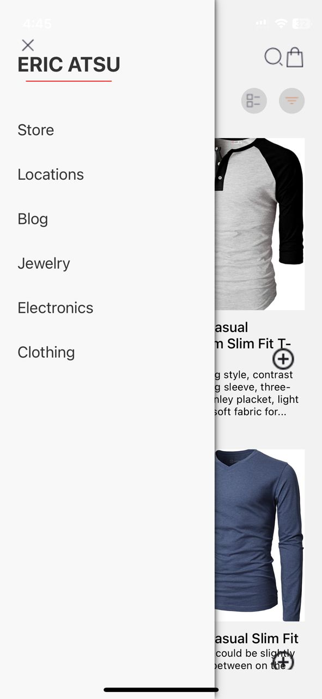

# -rn-assignment7-11259806
This is an ecommerce app for purchasing clothes and accessories
Users can add product to cart, remove products, and checkout as shown in the screenshots further down below.

# HomePage
This page displays all products from the website. The data was fetched from an external API using fetch.

# DetailsPage
When a user taps on an image, they are routed to the details page where they'd find more information about how the product they're purchasing.

# CheckOut
Once a user adds products to their cart, and tap on the shopping cart button, they're sent to the checkout page to finalize their order.

# Sidebar

